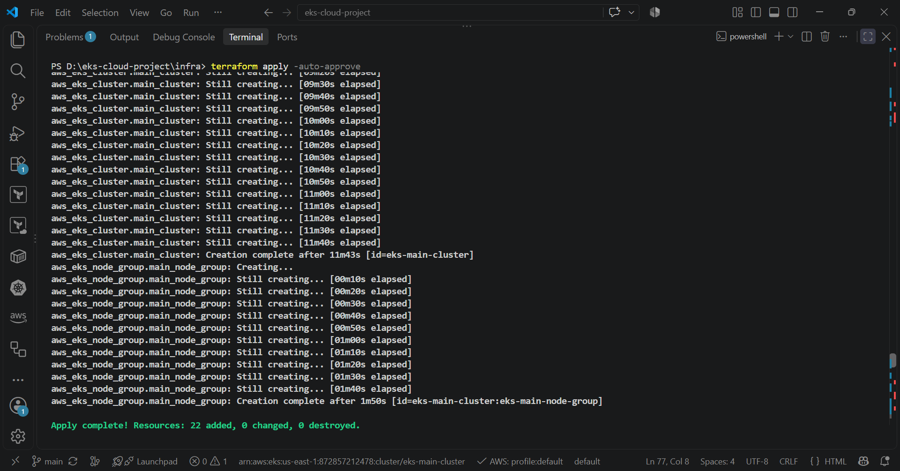
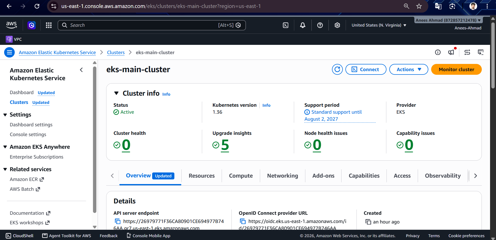
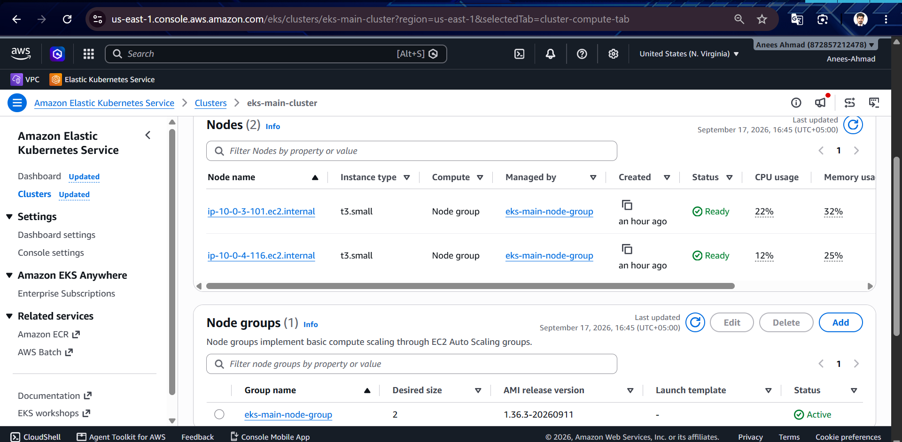
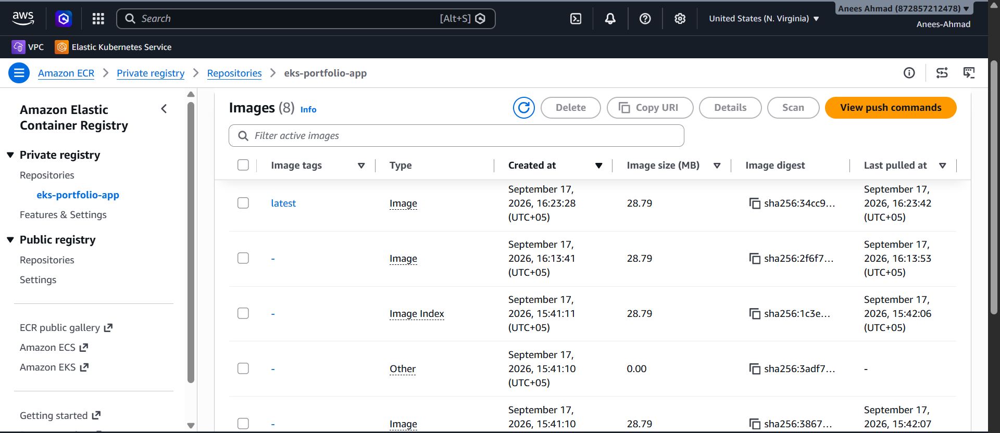
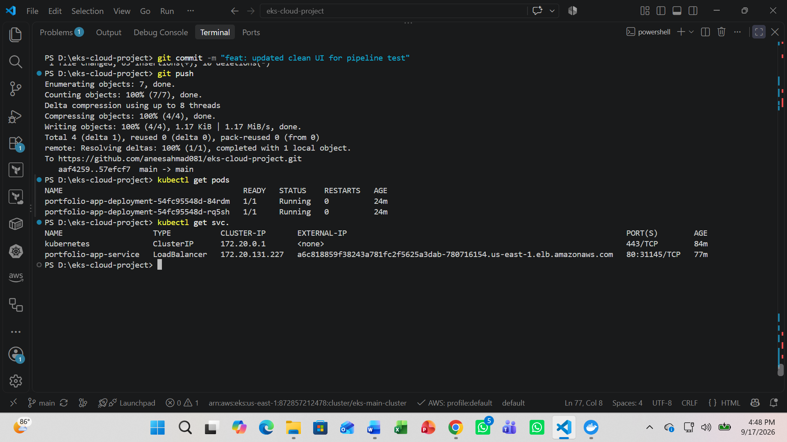
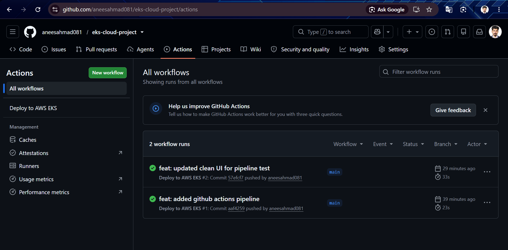
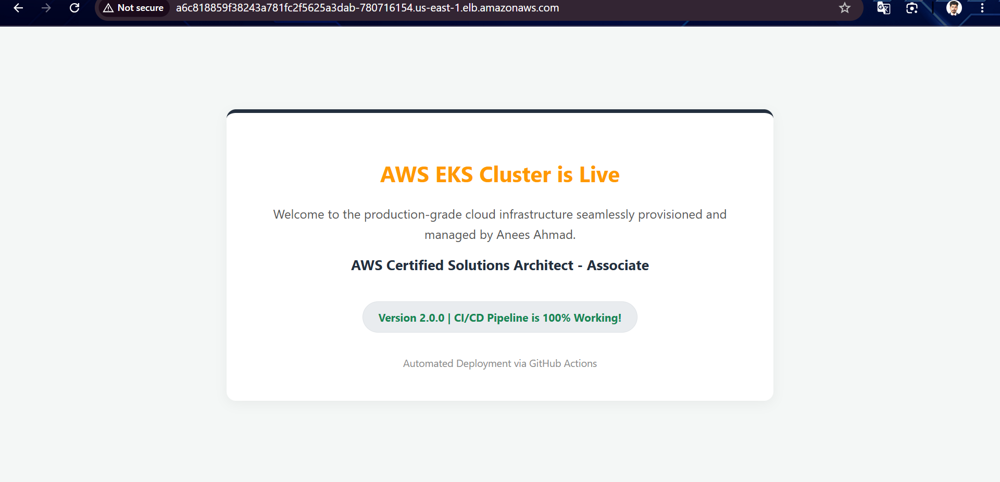

# ☁️ AWS EKS Cloud Infrastructure & CI/CD

A hands-on AWS cloud infrastructure and CI/CD project for deploying a containerized web application on **Amazon Elastic Kubernetes Service (EKS)**.

This project uses **Terraform** for Infrastructure as Code (IaC), **Docker** for containerization, **Amazon ECR** for container image storage, **Kubernetes** for application orchestration, and **GitHub Actions** for automated CI/CD.

The infrastructure is designed with a focus on **security, high availability, scalability, and automation**, following relevant AWS Well-Architected Framework principles.

---

## 🏗️ Architecture

The project provisions a custom AWS environment across two Availability Zones.

### Architecture Components

* **Amazon VPC**
* **2 Availability Zones**

  * `us-east-1a`
  * `us-east-1b`
* **Public Subnets**
* **Private Subnets**
* **Internet Gateway**
* **NAT Gateway**
* **Amazon EKS**
* **EKS Managed Node Group**
* **EC2 `t3.small` worker nodes**
* **Amazon ECR**
* **AWS Load Balancer**
* **IAM Roles**
* **Terraform**
* **Docker**
* **Kubernetes**
* **GitHub Actions**

### Network Architecture

```text
                         Internet
                            │
                            ▼
                    ┌───────────────┐
                    │ Internet      │
                    │ Gateway       │
                    └───────┬───────┘
                            │
                ┌───────────┴───────────┐
                │        AWS VPC        │
                │                       │
        ┌───────▼───────┐     ┌────────▼───────┐
        │ Public Subnet │     │ Public Subnet  │
        │     AZ-1      │     │      AZ-2      │
        │               │     │                │
        │ NAT Gateway   │     │ NAT Gateway*   │
        └───────┬───────┘     └────────┬───────┘
                │                       │
        ┌───────▼───────┐     ┌────────▼───────┐
        │ Private       │     │ Private        │
        │ Subnet AZ-1   │     │ Subnet AZ-2    │
        │               │     │                │
        │ EKS Node      │     │ EKS Node       │
        │ t3.small      │     │ t3.small       │
        └───────────────┘     └────────────────┘
                    │
                    ▼
              Amazon EKS
                    │
                    ▼
             Kubernetes Pods
                    │
                    ▼
             AWS Load Balancer
                    │
                    ▼
              Web Application
```

> *The exact number of NAT Gateways depends on the Terraform configuration. The architecture diagram should match the resources actually deployed.*

---

## 📸 Project Screenshots

The following screenshots demonstrate the infrastructure, deployment, CI/CD pipeline, and running application.

### 1. 🏗️ Architecture Diagram



**Shows:**
The overall AWS architecture, including VPC, Availability Zones, public/private subnets, NAT Gateway, EKS, worker nodes, and Load Balancer.

---

### 2. ☸️ EKS Cluster



**Shows:**
The Amazon EKS cluster successfully created and running in AWS.

---

### 3. 🖥️ EKS Worker Nodes



**Shows:**
The EKS managed node group and worker nodes running on `t3.small` EC2 instances.

---

### 4. 📦 Amazon ECR Repository



**Shows:**
The Docker image successfully pushed to the Amazon Elastic Container Registry (ECR).

---

### 5. ☸️ Kubernetes Pods



**Shows:**

```bash
kubectl get pods
```

The screenshot demonstrates that the application pods are successfully running inside the EKS cluster.

---

### 6. ⚙️ GitHub Actions CI/CD



**Shows:**
A successful GitHub Actions workflow that:

1. Checks out the source code.
2. Authenticates with AWS.
3. Builds the Docker image.
4. Pushes the image to Amazon ECR.
5. Connects to Amazon EKS.
6. Deploys the application to Kubernetes.

---

### 7. 🌐 Live Application



**Shows:**
The web application successfully running through the AWS Load Balancer endpoint.

---

## 📂 Project Structure

```text
aws-eks-cloud-infrastructure/
│
├── infra/
│   ├── main.tf
│   ├── variables.tf
│   ├── outputs.tf
│   ├── providers.tf
│   └── ...
│
├── app/
│   ├── index.html
│   └── Dockerfile
│
├── k8s/
│   ├── deployment.yaml
│   └── service.yaml
│
├── screenshots/
│   ├── architecture.png
│   ├── eks-cluster.png
│   ├── eks-nodes.png
│   ├── ecr-repository.png
│   ├── kubernetes-pods.png
│   ├── github-actions.png
│   └── live-application.png
│
├── .github/
│   └── workflows/
│       └── deploy.yml
│
└── README.md
```

---

# 🛠️ Technologies Used

| Technology            | Purpose                                         |
| --------------------- | ----------------------------------------------- |
| **AWS VPC**           | Network isolation and infrastructure networking |
| **Amazon EKS**        | Managed Kubernetes cluster                      |
| **Amazon EC2**        | EKS worker nodes                                |
| **Amazon ECR**        | Docker image registry                           |
| **IAM**               | Identity and access management                  |
| **AWS Load Balancer** | Exposing the application                        |
| **Terraform**         | Infrastructure as Code                          |
| **Docker**            | Application containerization                    |
| **Kubernetes**        | Container orchestration                         |
| **kubectl**           | Kubernetes cluster management                   |
| **GitHub Actions**    | CI/CD automation                                |
| **Git & GitHub**      | Version control                                 |

---

# 📋 Prerequisites

Before deploying this project, install and configure:

* AWS CLI
* Terraform
* Docker
* kubectl
* Git
* An AWS account with sufficient permissions

Verify AWS CLI:

```bash
aws sts get-caller-identity
```

Verify Terraform:

```bash
terraform version
```

Verify Docker:

```bash
docker --version
```

Verify kubectl:

```bash
kubectl version --client
```

Verify Git:

```bash
git --version
```

---

# 🚀 Deployment Guide

## Phase 1 — Provision Infrastructure with Terraform

Navigate to the infrastructure directory:

```bash
cd infra
```

Initialize Terraform:

```bash
terraform init
```

Review the infrastructure plan:

```bash
terraform plan
```

Apply the configuration:

```bash
terraform apply
```

Terraform provisions the AWS infrastructure defined in the `infra/` directory.

Depending on the configuration, this can include:

* VPC
* Availability Zones
* Public and private subnets
* Route tables
* Internet Gateway
* NAT Gateway
* IAM roles
* ECR repository
* EKS cluster
* EKS managed node group

> ⏱️ EKS resources can take several minutes to provision. The actual deployment time depends on AWS and the resources configured in Terraform.

---

# 🔗 Phase 2 — Configure kubectl

After the EKS cluster has been created, configure your local Kubernetes client:

```bash
aws eks update-kubeconfig \
  --region us-east-1 \
  --name eks-main-cluster
```

Verify the cluster connection:

```bash
kubectl cluster-info
```

Check the worker nodes:

```bash
kubectl get nodes
```

Expected output should show your EKS worker nodes in the `Ready` state.

---

# 🐳 Phase 3 — Build the Docker Image

Navigate to the application directory:

```bash
cd ../app
```

Build the Docker image:

```bash
docker build -t eks-demo-app .
```

Run the application locally:

```bash
docker run -p 8080:80 eks-demo-app
```

Open:

```text
http://localhost:8080
```

---

# 📦 Phase 4 — Push the Image to Amazon ECR

Authenticate Docker with Amazon ECR:

```bash
aws ecr get-login-password --region us-east-1 | \
docker login \
--username AWS \
--password-stdin <AWS_ACCOUNT_ID>.dkr.ecr.us-east-1.amazonaws.com
```

Tag the Docker image:

```bash
docker tag eks-demo-app:latest \
<AWS_ACCOUNT_ID>.dkr.ecr.us-east-1.amazonaws.com/<ECR_REPOSITORY>:latest
```

Push the image:

```bash
docker push \
<AWS_ACCOUNT_ID>.dkr.ecr.us-east-1.amazonaws.com/<ECR_REPOSITORY>:latest
```

Replace:

```text
<AWS_ACCOUNT_ID>
<ECR_REPOSITORY>
```

with the values from your AWS environment.

---

# ☸️ Phase 5 — Deploy to Amazon EKS

Navigate to the Kubernetes directory:

```bash
cd ../k8s
```

Make sure the image reference in `deployment.yaml` points to your ECR repository.

Example:

```yaml
image: <AWS_ACCOUNT_ID>.dkr.ecr.us-east-1.amazonaws.com/<ECR_REPOSITORY>:latest
```

Apply the Deployment:

```bash
kubectl apply -f deployment.yaml
```

Apply the Service:

```bash
kubectl apply -f service.yaml
```

Check the Deployment:

```bash
kubectl get deployments
```

Check the Pods:

```bash
kubectl get pods
```

Check the Service:

```bash
kubectl get services
```

If the Service is configured with:

```yaml
type: LoadBalancer
```

AWS will provision the appropriate load-balancing resource for the Service.

---

# ⚙️ Phase 6 — GitHub Actions CI/CD

The CI/CD workflow is located at:

```text
.github/workflows/deploy.yml
```

The pipeline automates the application deployment process.

### CI/CD Flow

```text
Developer
    │
    │ git push
    ▼
GitHub Repository
    │
    ▼
GitHub Actions
    │
    ├── Checkout Code
    │
    ├── Configure AWS Credentials
    │
    ├── Build Docker Image
    │
    ├── Push Image → Amazon ECR
    │
    ├── Configure kubectl
    │
    └── Deploy → Amazon EKS
                       │
                       ▼
                Kubernetes Pods
                       │
                       ▼
                AWS Load Balancer
                       │
                       ▼
                Web Application
```

---

# 🔐 GitHub Actions Secrets

If your workflow uses AWS access keys, configure the required secrets under:

```text
GitHub Repository
→ Settings
→ Secrets and variables
→ Actions
```

Example:

```text
AWS_ACCESS_KEY_ID
AWS_SECRET_ACCESS_KEY
```

### 🔒 Security Recommendation

For production environments, **GitHub Actions OIDC with an AWS IAM role** is recommended over long-lived AWS access keys.

Never commit credentials directly to the repository.

Do not place the following inside source code:

```text
AWS Access Key
AWS Secret Access Key
AWS Session Token
Passwords
Private Keys
```

---

# 🔍 Useful Kubernetes Commands

### Check Nodes

```bash
kubectl get nodes
```

### Check Pods

```bash
kubectl get pods
```

### Check Services

```bash
kubectl get services
```

### Check Deployments

```bash
kubectl get deployments
```

### View Pod Logs

```bash
kubectl logs <pod-name>
```

### Describe a Pod

```bash
kubectl describe pod <pod-name>
```

### Check Deployment Status

```bash
kubectl rollout status deployment/<deployment-name>
```

### Restart a Deployment

```bash
kubectl rollout restart deployment/<deployment-name>
```

---

# 🧹 Cleanup

AWS resources such as **EKS, NAT Gateway, EC2 instances, and Load Balancers** may incur charges.

When you finish practicing, destroy the Terraform-managed infrastructure:

```bash
cd infra
terraform destroy
```

Review the resources Terraform plans to remove before confirming.

> ⚠️ Only run `terraform destroy` if the Terraform state/configuration manages resources that you are safe to remove.

---

# 🎯 Project Objectives

This project demonstrates practical experience with:

* AWS cloud infrastructure
* Infrastructure as Code
* Terraform
* Amazon EKS
* Kubernetes
* Docker
* Amazon ECR
* VPC networking
* Public and private subnets
* IAM
* AWS Load Balancing
* GitHub Actions
* CI/CD
* Automated application deployment

---

# 📚 Key Learning Outcomes

Through this project, I gained hands-on experience with the complete cloud deployment lifecycle:

```text
Application Code
       ↓
     Docker
       ↓
   Amazon ECR
       ↓
  Amazon EKS
       ↓
  Kubernetes
       ↓
AWS Load Balancer
       ↓
Web Application
```

I also learned how to combine **Terraform, Docker, Kubernetes, AWS, and GitHub Actions** to create an automated cloud deployment workflow.

---

# 🔐 Security Considerations

The project incorporates several security-focused practices:

* EKS worker nodes deployed in private subnets
* IAM roles for AWS resource access
* Network segmentation using public and private subnets
* Security Groups for network access control
* Secrets stored outside source code
* No hard-coded AWS credentials
* Recommendation to use GitHub Actions OIDC for production CI/CD

---

# 🚀 Future Improvements

Potential improvements for future versions include:

* GitHub Actions OIDC authentication
* HTTPS with AWS Certificate Manager
* Route 53 custom domain
* CloudWatch monitoring and logging
* Kubernetes Horizontal Pod Autoscaler
* EKS cluster autoscaling
* Terraform remote state using S3 and DynamoDB/state locking where appropriate
* Separate development and production environments
* Terraform modules for reusable infrastructure
* Kubernetes Secrets management
* Helm-based deployments

---

# 👨‍💻 Author

**Anees Ahmad**

**AWS Certified Solutions Architect – Associate**

**BS Information Technology**

---

## ⭐ Project Focus

```text
AWS
EKS
Kubernetes
Terraform
Docker
Amazon ECR
GitHub Actions
CI/CD
Cloud Infrastructure
Infrastructure as Code
```

---

## 📌 Disclaimer

This project was created as a hands-on learning and portfolio project to demonstrate practical AWS cloud, Kubernetes, Terraform, Docker, and CI/CD skills.

AWS resources should be destroyed when they are no longer required to help avoid unnecessary charges.
